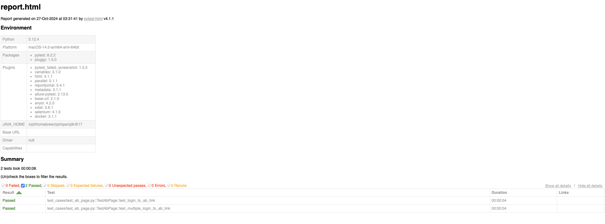

## Senior Quality Engineer Take-Home Assignment
Below is a take-home assignment. You are required to complete the following task below.

The automation framework uses pytest and selenium as its technology stack.

There is a single test already written in the automation to navigate to 'https://the-internet.herokuapp.com/', clicks on abtest page, and checks if the user lands successfully.

Your automation test is to do the following below.

1. Choose 3 of the examples at the page "the-internet.herokuapp.com". Example: Drag and Drop

2. Write a test to navigate to that page and create any 3 test cases of your choosing. Example: User is able to drag and drop a box successfully

3. Run your code and generate a report using pytest-html.

4. Submit the report to the interviewer with a screenshot via email. Zip the code framework edited and upload to the google drive provided in the email.

5. Please be ready to go over code during your next interview session.

Example Below:

### How to run the test
Before running the test. Make sure to install all the required packages to the project
* pip install -r requirements. txt in your terminal
* Last python version used is 3.12.4

Navigate to root folder and run
* $ pytest --html=reports/report.html
* Default Browser is firefox
  * add --browser option to run a different browser e.g. --browser edge
* Browser Options:
  * chrome
  * edge
  * firefox
* To run specific marked tests
  * pytest --html=reports/report.html -m smoke

### Tips on completing this assignment
- Any blocking questions please reach out to interviewer
- Communicate effectively like you are going to communicate with the actual team member.
- Select tests that are more difficult to solve
- Be creative!